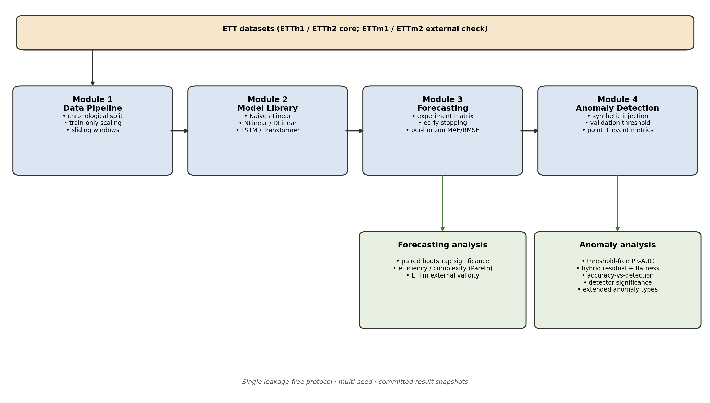

# ETT Transformer Oil Temperature Forecasting and Anomaly Detection

> A research showcase accompanying the MSc dissertation *Residual-based Transformer
> Forecasting for Oil Temperature Anomaly Detection* (University of Warwick, 2026).

A unified, **leakage-free** study connecting transformer oil-temperature forecasting
with **residual-based synthetic anomaly detection** on the ETT datasets — paired with
an interactive companion website.

**🔗 Live demo — <https://shuyanglovechocolate-ctrl.github.io/ETT-Transformer-Anomaly-Detection/>**

[](https://shuyanglovechocolate-ctrl.github.io/ETT-Transformer-Anomaly-Detection/)

## Features

- **Forecasting** — six models (Naive → Transformer) compared under one leakage-free, multi-seed protocol.
- **Residual anomaly detection** — spike / level-shift / frozen synthetic injection scored from forecast residuals.
- **Accuracy vs detection** — tests whether better forecasts imply better detection (they do not, cleanly).
- **Efficiency** — accuracy against parameter count; linear baselines rival the Transformer at a fraction of the size.
- **Frozen failure case** — where the residual signal fails, diagnosed, with a flatness-based fix.
- **Attention analysis** — a descriptive look at where the Transformer allocates attention.
- **Reproducibility** — pinned environment, chronological splits, train-only scaler, committed result tables.

## Project Overview

This project builds a unified, reproducible framework that connects **transformer
oil-temperature (OT) forecasting** on the Electricity Transformer Temperature (ETT)
datasets with **residual-based synthetic anomaly detection**. It systematically
compares strong simple baselines (Naive, Linear, NLinear, DLinear) against a
recurrent model (LSTM) and an attention-based model (Transformer), then reuses the
resulting forecast residuals to detect injected anomalies and analyses where this
residual signal is effective and where it fails.

## Research Question

> How effectively can a unified forecasting-residual framework predict transformer
> oil temperature and detect synthetic anomalies on ETT datasets, while assessing
> whether complex deep-learning models outperform simpler linear baselines?

## Related Work and Positioning

Time-series anomaly detection has been studied extensively. Reconstruction- and
representation-based deep detectors (e.g. OmniAnomaly, USAD) and attention-based
detectors (e.g. the Anomaly Transformer) are typically trained on normal data and
evaluated on labelled multivariate anomaly benchmarks such as SMD, SMAP and MSL. In
parallel, the ETT datasets are a standard long-sequence *forecasting* benchmark, where
Transformer-family models (Informer, and more recent patch- or inversion-based
architectures such as PatchTST and iTransformer) are compared against strong linear
baselines (NLinear / DLinear, Zeng et al., AAAI 2023).

This project sits deliberately between these two lines of work rather than competing
with either. It does **not** train a dedicated detector on labelled anomaly benchmarks,
and it does **not** aim to advance forecasting state of the art on ETT. Instead it asks
whether the *residuals* of standard OT forecasters, produced under a single leakage-free
protocol, carry a usable anomaly signal under controlled synthetic injection — and how
that signal relates to forecasting accuracy.

> **Positioning.** This work does not aim to propose a new state-of-the-art anomaly
> detector. It contributes a leakage-free, reproducible empirical study connecting
> forecasting accuracy, residual behaviour and synthetic anomaly detection on ETT.

Because the problem setup differs (single-target forecasting residuals on ETT with
synthetic injection, versus train-on-normal reconstruction on labelled multivariate
benchmarks), the deep anomaly detectors above are **complementary references**, not
head-to-head baselines. The baselines evaluated here are causal statistical detectors
compared under an identical protocol (Module 4).

The table below positions the repository against the main lines of related work;
per-work citations are collected under [References](#references). It is a positioning
aid, **not** a substitute for the full dissertation literature review.

| Area | Representative work | Typical setting | Relevance to this project |
|---|---|---|---|
| Long-term forecasting Transformers | Informer, PatchTST, iTransformer | Forecasting benchmarks, often multivariate long-horizon settings | This project compares a controlled vanilla Transformer baseline rather than modern specialised Transformer forecasters. |
| Linear forecasting baselines | DLinear / NLinear | Long-term time-series forecasting benchmarks | Motivates the comparison between simple linear-family models and deeper architectures. |
| Deep anomaly detection | OmniAnomaly, USAD, Anomaly Transformer | Train-on-normal or unsupervised multivariate anomaly detection benchmarks such as SMD / SMAP / MSL | These methods address a different anomaly-detection setting from this project's forecasting-residual synthetic injection protocol. |
| Forecasting-residual detection | Residual scoring and validation-threshold monitoring | Forecast first, detect from residual deviations | This is the empirical setting studied here. |

## Research Gap and Contribution

The gap addressed here is not a lack of anomaly-detection methods in general. It is that
the ETT forecasting benchmark and residual-based anomaly detection are rarely connected
**systematically under one leakage-free protocol** — with matched causal baselines,
threshold-free evaluation, event-wise metrics and residual diagnostics — so that the
relationship between forecasting accuracy and detection usefulness can be examined
directly.

This project contributes:

1. a **unified forecasting-to-residual framework** with a leakage-free, config-driven
   data and training pipeline (Modules 1–2);
2. a **controlled comparison** of simple, recurrent and Transformer forecasters with
   per-horizon analysis and paired bootstrap significance testing (Module 3);
3. **residual-based synthetic anomaly detection** with causal statistical baselines,
   validation-only thresholding, multi-seed robustness and event-wise evaluation
   (Module 4);
4. **threshold-free, event-wise and hybrid residual–flatness analysis** that separates
   genuine detectability from threshold artefacts and rescues stuck-sensor anomalies;
5. an **accuracy-vs-detection cross-analysis** showing that lower forecasting error does
   not straightforwardly translate into better anomaly detection.

The emphasis throughout is **leakage-free reproducibility and honest negative results**
rather than maximal detection scores.

## Dataset

### Source

The project uses the four public ETT (Electricity Transformer Temperature) datasets released with the Informer paper (Zhou et al., AAAI 2021): https://github.com/zhouhaoyi/ETDataset. The CSV files are stored locally under `data/raw/`.

- `ETTh1`, `ETTh2` — hourly data (1 record per hour)
- `ETTm1`, `ETTm2` — 15-minute data (1 record per 15 minutes)

This project primarily uses `ETTh1` and `ETTh2`, and may extend to `ETTm1` / `ETTm2`.

### Fields

| Field | Meaning |
| --- | --- |
| `date` | Timestamp |
| `HUFL` / `HULL` | High UseFul Load / High UseLess Load |
| `MUFL` / `MULL` | Middle UseFul Load / Middle UseLess Load |
| `LUFL` / `LULL` | Low UseFul Load / Low UseLess Load |
| `OT` | Oil Temperature — the forecasting target |

The forecasting target is `OT`.

## Methodology



*Regenerate with `python experiments/make_methodology_diagram.py`.*

The project is organised into four modules, each with pytest coverage and
committed result snapshots:

- **Module 1 — Data Pipeline:** leakage-free chronological split, train-only
  scaling, sliding windows, PyTorch DataLoaders.
- **Module 2 — Forecasting Model Library:** Naive, Linear, NLinear, DLinear, LSTM
  and Transformer under one input-output contract.
- **Module 3 — Forecasting Experiments:** batch experiment matrix, early stopping,
  per-horizon and paired-bootstrap significance analysis, best-model selection.
- **Module 4 — Synthetic Anomaly Detection:** residual aggregation, anomaly
  injection, validation-based thresholding, detection, point-wise and event-wise
  evaluation, causal baselines and diagnostics.

Each module is detailed below.

## Module 1: Data Pipeline

Module 1 establishes a reproducible and leakage-free ETT data processing pipeline. It includes chronological train/validation/test splitting, training-only feature and target scaling, configurable univariate and multivariate input construction, independent sliding-window generation within each split, and PyTorch DataLoader preparation for multi-horizon oil temperature forecasting.

### Train / Validation / Test split

The data is split **in chronological order** (never shuffled) into:

- Train: 70%
- Validation: 10%
- Test: 20%

**Rationale.** This ratio is broadly consistent with common ETT benchmark settings, which makes the results easier to compare with existing literature. 70% of the data provides sufficient training samples for the LSTM and Transformer models; the validation set is used for model selection and early stopping; the test set is used only for final evaluation. Shuffling is avoided because randomly splitting a time series would let future observations leak into the training set.

### Leakage-free processing order

The order of scaling and windowing is strict and must not be reordered:

```text
raw data
-> time-based split (train / val / test)
-> fit scaler on train only
-> transform train / val / test with the same scalers
-> create sliding windows independently inside each split
```

Fitting the scaler on the full dataset would expose validation/test distribution information to training. Building windows on the full series before splitting would create windows crossing split boundaries, leaking future data into training. Both are avoided.

### `scaler_x` vs `scaler_y`

Two separate `StandardScaler`s are maintained, both fitted on the training split only:

- **`scaler_x`** standardises the input features. For multivariate input it is fitted on all 7 columns `[HUFL, HULL, MUFL, MULL, LUFL, LULL, OT]`; for univariate input on `[OT]` only.
- **`scaler_y`** is fitted only on the training `OT` column. It is used to inverse-transform model predictions and ground truth back to the original oil-temperature scale.

`scaler_x` cannot be used to inverse-transform OT: in the multivariate setting it expects 7 columns, while model outputs are a single OT column, which would cause a dimension mismatch and unreliable metrics. Therefore **all predictions, ground truth and residuals are inverse-transformed with `scaler_y`**, and MAE / RMSE and anomaly residuals are computed in the original OT scale for interpretability.

### `input_len` and `horizon`

- `input_len`: number of past time steps used as input (default 96).
- `horizon`: number of future OT steps to predict (e.g. 24 / 48 / 96).

A sample uses the past `input_len` steps of input features to predict the next `horizon` steps of OT.

### Univariate vs multivariate input

- **Univariate**: `features = [OT]`, `num_features = 1`. Tests whether OT history alone is enough to forecast future OT.
- **Multivariate**: `features = [HUFL, HULL, MUFL, MULL, LUFL, LULL, OT]`, `num_features = 7`. Tests whether load-related covariates improve OT forecasting.

`num_features` is derived dynamically from `input_type` and never hard-coded, so downstream models must read it from the DataLoader / config.

### Sliding window output shapes

```text
X : [num_samples, input_len, num_features]
y : [num_samples, horizon]
```

Each split yields `len(split) - input_len - horizon + 1` samples; windows that would cross a split boundary are dropped by design (this prevents leakage and is not a bug).

### Evaluation interface and acceptance check

`src/evaluate.py` provides `calculate_forecasting_metrics()` and `calculate_residuals()`, both of which inverse-transform predictions and ground truth with `scaler_y` and compute MAE / RMSE / residuals in the original OT scale.

A lightweight interface check script is provided in `experiments/check_module1_pipeline.py`. It verifies that Module 1 can produce DataLoaders, metadata, `scaler_y`, and original-scale MAE / RMSE / residual calculations for the downstream forecasting and anomaly-detection modules. Run it with:

```bash
python experiments/check_module1_pipeline.py
```

> **Correlation caveat.** The EDA correlation matrix is exploratory only. High correlation does not guarantee a variable improves forecasting, and low correlation does not mean it is useless, because correlation captures only linear, non-lagged relationships. The real contribution of load covariates is evaluated later through input ablation experiments (OT-only vs. OT + all covariates).

## Project Structure

```text
data/raw/                     # ETTh1/h2/m1/m2 CSV files
notebooks/                    # 01_eda.ipynb, 02_data_pipeline.ipynb
src/
  data/                       # Module 1: loader, splitter, preprocessing, dataset, pipeline
  models/                     # Module 2: base, naive, linear, nlinear, dlinear, lstm,
                              #           transformer, factory, utils
  training/                   # Module 3: trainer, evaluator, predictor, checkpoint,
                              #           early_stopping, experiment, plots
  anomaly/                    # Module 4: residuals, injection, thresholds, detector,
                              #           metrics, event_metrics, baselines, diagnostics, plots
  evaluate.py                 # original-scale MAE / RMSE / residuals
configs/                      # experiment configs (+ generated/, git-ignored)
experiments/                  # runnable scripts (matrix runners, summaries, diagnostics)
tests/                        # pytest suites for all four modules
results/
  metrics/                    # forecasting summary tables (committed)
  figures/                    # figures (mostly git-ignored; representative ones kept)
  anomaly/metrics/            # anomaly result tables + summaries (committed)
  anomaly/figures/            # representative anomaly figures (committed)
  checkpoints/ predictions/ logs/   # heavy artifacts (git-ignored)
```

### Unified pipeline entry

`src/data/pipeline.py` exposes `build_data_pipeline(config)`, which runs the
whole leakage-free flow and returns ready-to-use DataLoaders, scalers, metadata
and per-window target dates. Downstream modules only need:

```python
from src.utils.config import load_config
from src.data.pipeline import build_data_pipeline

config = load_config("configs/ETTh1_multivariate_h24.yaml")
data = build_data_pipeline(config, save_metadata=True)

train_loader = data["train_loader"]
val_loader = data["val_loader"]
test_loader = data["test_loader"]
num_features = data["num_features"]   # model input_dim
horizon = data["horizon"]             # model output_dim
scaler_y = data["scaler_y"]           # original-scale metrics
```

The config is validated up front (`validate_config()` checks input_type, split
ratios, positive window/batch sizes and dataset path). Each window also carries
`y_dates` (shape `[num_samples, horizon]`) so predictions, residuals and
anomalies can be plotted against real timestamps. Pipeline metadata
(sample counts, features, horizon, ...) is saved to `results/metrics/` for
reproducibility.

Run the tests with:

```bash
pytest tests/
```

To batch-generate experiment configs for Module 3:

```bash
python experiments/generate_configs.py
```

This writes one YAML per `dataset x input_type x input_len x horizon x seed`
combination into `configs/generated/` (git-ignored, regenerate on demand).

### Data Contract

Module 1 guarantees the following interface to downstream modules:

| Name | Shape / type | Meaning |
| --- | --- | --- |
| `X` (batch) | `[batch_size, input_len, num_features]` | Model input window |
| `y` (batch) | `[batch_size, horizon]` | Forecast target (OT, scaled) |
| `y_dates` | `[num_samples, horizon]` | Real timestamp of every target step |
| `num_features` | `int` (1 univariate / 7 multivariate) | Model `input_dim` |
| `horizon` | `int` | Model `output_dim` |
| `feature_cols` | `list[str]` | Ordered input feature names |
| `input_type` | `str` | `"univariate"` or `"multivariate"` |
| `scaler_y` | fitted scaler | Inverse-transform predictions to original OT scale |
| `train_loader` / `val_loader` / `test_loader` | `DataLoader` | Batched samples (train shuffled; val/test not) |

Module 2 (models) reads `num_features` and `horizon`; Module 3 (training) reads
the three DataLoaders; Modules 3/4 use `scaler_y` for original-scale MAE / RMSE /
residuals and `y_dates` for time-aligned plots. All values are produced by
`build_data_pipeline(config)`.

## Module 2: Forecasting Model Library

Module 2 implements a unified forecasting model library spanning models of
increasing capacity: Naive, Linear, NLinear, DLinear, LSTM and Transformer
forecasters. All models follow the same input-output contract, taking windowed
ETT sequences with shape `[batch_size, input_len, num_features]` and producing
multi-horizon OT forecasts with shape `[batch_size, horizon]`. Module 2 only
defines the models; training, metrics and anomaly detection belong to later
modules.

The forecasting library compares models with increasing modelling assumptions
and capacity: a non-parametric persistence baseline, direct and normalized
linear models, a decomposition-based linear model, a recurrent neural network,
and an attention-based Transformer encoder. This supports the research question
of whether attention-based models are consistently better than simpler linear
and recurrent baselines for ETT oil-temperature forecasting (cf. Zeng et al.,
AAAI 2023).

### Models

| Model | File | Idea |
| --- | --- | --- |
| `naive` | `src/models/naive.py` | Repeat the last input OT value across the horizon (persistence sanity check, no training). |
| `linear` | `src/models/linear.py` | Flatten the window and map it to the horizon with one linear layer (plain linear baseline). |
| `nlinear` | `src/models/nlinear.py` | Subtract the last value, predict the change with a linear layer, add the last OT value back (NLinear-inspired, robust to level shifts). |
| `dlinear` | `src/models/dlinear.py` | Decompose into trend (moving average) + seasonal and project each to the horizon. Channel-mixing by default; `channel_independent: true` uses per-channel temporal projection plus a linear mixing head. |
| `lstm` | `src/models/lstm.py` | LSTM encoder, last hidden state projected to the horizon. |
| `tcn` | `src/models/tcn.py` | Stacked residual blocks of dilated **causal** 1-D convolutions (dilation 1, 2, 4, …); the final-step representation is projected to the horizon. A convolutional alternative to the recurrent/attention baselines. |
| `transformer` | `src/models/transformer.py` | Input projection + sinusoidal positional encoding + self-attention encoder + pooling + linear head. Supports `forward(x, return_attention=True)` for exploratory attention analysis. |

Models are registered in `MODEL_REGISTRY` (`src/models/factory.py`), the single
source of truth for supported names. Each model also exposes metadata
attributes (`model_type`, `supports_attention`, `supports_multivariate`,
`requires_feature_cols`, `description`) surfaced by `get_model_summary()`.

All models subclass `BaseForecaster` (`src/models/base.py`) and read
`num_features` / `horizon` dynamically (never hard-coded). The Naive baseline
resolves the OT column index from `feature_cols`, so it works for both
univariate and multivariate inputs.

> **Note on DLinear.** `DLinearForecaster` is a decomposition-based,
> DLinear-inspired forecaster: it splits the input into trend and seasonal
> components and projects each to the target horizon using the flattened
> multivariate window (variant A, shared/flattened). It is not a full
> reproduction of the original paper; a channel-independent variant could be
> added later if required.

### Model factory and config

A `model` section selects the model and its hyper-parameters:

```yaml
# Naive
model:
  name: naive

# Linear
model:
  name: linear

# NLinear
model:
  name: nlinear

# DLinear (decomposition)
model:
  name: dlinear
  kernel_size: 25            # moving-average window for trend extraction
  channel_independent: false # true -> per-channel temporal projection + mixing head

# LSTM
model:
  name: lstm
  hidden_dim: 64
  num_layers: 2
  dropout: 0.2

# TCN (dilated causal convolutions)
model:
  name: tcn
  num_channels: 32   # channels per residual block
  num_layers: 4      # dilation doubles each block (receptive field grows 2^n)
  kernel_size: 3     # >= 2
  dropout: 0.1

# Transformer
model:
  name: transformer
  d_model: 64       # must be divisible by nhead
  nhead: 4
  num_layers: 2
  dim_feedforward: 128
  dropout: 0.1
  pooling: last     # "last" or "mean"
```

Module 3 builds any model in one call:

```python
from src.models import build_model, get_model_summary

model = build_model(config, num_features=data["num_features"],
                    feature_cols=data["feature_cols"])
y_pred = model(x)   # [batch_size, input_len, num_features] -> [batch_size, horizon]
summary = get_model_summary(model, model_name=config["model"]["name"])
# -> {"model_name", "class_name", "total_parameters", "trainable_parameters",
#     "input_len", "num_features", "horizon"}
```

### Model Configuration Contract

Every model config must contain a `model.name` field. Supported names:
`naive`, `linear`, `nlinear`, `dlinear`, `lstm`, `transformer`. `build_model()`
calls `validate_model_config()` first, so an invalid config fails at build time
rather than mid-training. Model-specific rules:

- **dlinear**: `kernel_size` must be a positive odd integer (default 25);
  `channel_independent` must be a boolean (default false).
- **lstm**: `hidden_dim > 0`, `num_layers > 0`, `0 <= dropout < 1`
  (dropout has no effect when `num_layers == 1`).
- **transformer**: `d_model > 0`, `nhead > 0`, `num_layers > 0`,
  `dim_feedforward > 0`, `0 <= dropout < 1`, `d_model % nhead == 0`,
  `pooling in {"last", "mean"}`.

`get_model_summary(model)` returns a serialisable dict (parameter counts +
dimensions) for Module 3 experiment logs.

Model utilities, forward-shape, factory and config-validation tests live in
`tests/test_models.py`.

## Module 3: Forecasting Experiments

Module 3 turns the pipeline and model library into a reproducible experiment
system. A single experiment is run with:

```bash
python src/train.py --config configs/ETTh1_multivariate_h24.yaml
```

It trains with **early stopping**, **gradient clipping** and an optional LR
scheduler, restores the **best-validation checkpoint** before testing, computes
MAE / RMSE / WAPE in the **original OT scale**, and records everything (metrics
JSON, prediction CSV with `residual` and `target_date`, config snapshot, and a
row in `results/metrics/experiment_log.csv`).

Batch experiments are run through a matrix runner (fail-soft, `--skip-existing`):

```bash
python experiments/run_matrix.py --matrix core-light   # 4 light models x 2 datasets x 2 input types x 3 horizons x 3 seeds
python experiments/run_matrix.py --matrix core-deep     # LSTM/Transformer, multivariate
python experiments/summarize_results.py                 # comparison tables (deduped by experiment_id)
python experiments/analyze_forecasting_results.py       # per-horizon metrics, best model, bootstrap significance
python experiments/analyze_efficiency_complexity.py     # accuracy vs parameters / checkpoint size (post-hoc)
python experiments/validate_results.py                  # completeness / consistency checks
```

The full study covers **192 forecasting runs** (core-light 144 + core-deep 36 +
a regularized deep-model robustness check 12).

## Module 4: Synthetic Anomaly Detection

Module 4 reuses Module 3 forecast residuals to detect injected anomalies, without
retraining any model. The pipeline is deliberately **leakage-free**:

```text
validation residual  -> threshold (percentile / mean+kstd / IQR / MAD)
test residual        -> inject anomaly into y_true (y_pred unchanged)
                     -> recompute anomalous residual -> detect (score > threshold)
                     -> point-wise and event-wise evaluation
```

Anomalies are injected only into `y_true` (spike / level_shift / frozen), so the
anomalous residual `y_true_anomalous - y_pred_clean` grows where anomalies occur.
Thresholds are learned **only from validation residuals**. Three causal
statistical baselines (`raw_zscore`, `diff_score`, `rolling_zscore`) are compared
against the residual detector under an identical protocol.

```bash
python experiments/prepare_anomaly_residuals.py    # validation inference + residual aggregation (6.1)
python experiments/run_anomaly_detection.py        # detector x threshold x anomaly x injection-seed matrix
python experiments/summarize_anomaly_results.py    # detector / type / threshold summaries
python experiments/run_magnitude_sensitivity.py    # F1 vs anomaly magnitude
python experiments/diagnose_anomaly_residuals.py   # residual + frozen-flatness diagnostics
python experiments/run_threshold_free_eval.py      # PR-AUC / ROC-AUC / best-F1 (removes threshold confound)
python experiments/run_hybrid_detection.py         # residual + flatness hybrid detectors
python experiments/prepare_multimodel_residuals.py # residuals for several forecasters (inference only)
python experiments/analyze_accuracy_vs_detection.py# does lower forecasting error imply better detection?
python experiments/analyze_anomaly_significance.py # paired bootstrap: residual vs causal baselines
python experiments/run_extended_anomaly_types.py   # drift / noise_burst / stuck_with_jitter stress test
```

## Key Results

### Forecasting (Module 3)

Linear-family models, especially **NLinear and DLinear, consistently outperform
LSTM and Transformer** under the tested ETT settings. Paired bootstrap confidence
intervals over per-window absolute errors support this: linear-family models
significantly beat the deep models in **all tested multivariate comparisons**
(36/36, non-overlapping 95% CIs). A regularized robustness check (lower LR, weight
decay, higher dropout) reduced deep-model variance but did **not** change the
ranking. Adding load covariates (multivariate) did not consistently improve OT
forecasting over univariate input.

**Interpretation and caveats.** These results should **not** be read as evidence that
Transformer models are generally unsuitable for ETT forecasting. The Transformer used
here is a vanilla encoder-style architecture trained under a controlled, equal-budget
protocol with light hyper-parameter tuning, rather than a modern long-sequence
architecture such as PatchTST or iTransformer. The regularized robustness check reduces
deep-model variance but is a robustness probe, not a full hyper-parameter search. The
conclusion is therefore scoped to the tested setting: **within this controlled,
equal-budget protocol, linear-family models are a stronger and cheaper default**, and
evaluating modern patch/inversion-based Transformers under the same budget is left as
future work.

**Efficiency and complexity.** The accuracy advantage of the linear family is not
bought with extra capacity — it is a joint win on both axes. The best linear models
(NLinear, DLinear, Linear) reach the lowest mean MAE (≈ 2.72–2.77) with the fewest
trainable parameters (≈ 16k–32k) and the smallest checkpoints (≈ 0.25–0.50 MB), while
the Transformer (≈ 69k parameters, ≈ 0.87 MB) and LSTM (≈ 53k parameters, ≈ 0.65 MB)
are both larger **and** less accurate (mean MAE ≈ 2.96 and 3.44). The linear family
therefore **Pareto-dominates** the deep baselines here: lower error at a fraction of the
parameters and storage. This strengthens the practical reading of the forecasting
results — under the tested protocol, model complexity does not translate into better
ETT oil-temperature forecasting, and the cheaper models are also the more deployable
ones. (See `efficiency_complexity_summary.csv`; the per-1k-parameter column is reported
for transparency only and is **not** used as an efficiency ranking, since dividing error
by parameter count mechanically favours larger models.)

**Inference latency.** A separate forward-pass timing (`inference_latency_summary.csv`,
freshly-built models on the ETTh1 test loader) reinforces the deployability point: the
linear family runs at ≈ 10–24 ms per 1000 windows, whereas the LSTM and Transformer are
≈ 5–12× slower (≈ 114 and ≈ 126 ms). Latency does **not** track parameter count — the LSTM
has fewer parameters than DLinear yet is ~5× slower, because its recurrence is sequential —
so latency adds deployability information beyond model size. Latency is architecture-
determined and weight-independent, so it is measured on freshly-built models; training
wall-clock time was not recorded historically and is deliberately not reported.

**External validity (minute-level ETTm).** As a check of external validity, the same
multivariate `input_len=96`, `horizon=96` protocol was run on the 15-minute **ETTm1 /
ETTm2** datasets over **three seeds** (42 / 2024 / 3407; Naive, Linear, NLinear, DLinear and
the Transformer; an isolated results directory that does not touch the core ETTh tables).
The core finding transfers robustly: a linear-family model has the lowest mean MAE on
**both** datasets and beats the Transformer in each case (ETTm1: NLinear 1.39 ± 0.06 vs
Transformer 1.50 ± 0.07; ETTm2: NLinear 2.71 ± 0.02 vs Transformer 3.15 ± 0.14), and the
Transformer also shows the **largest seed variance**. On ETTm1 the two best linear models
are effectively tied (NLinear 1.392 vs DLinear 1.393) and Naive is competitive (fourth), so
ETTm1 is a close result; ETTm2 shows a clearer linear-family advantage. Only the forecasting
stage was evaluated on ETTm; the anomaly-detection stage on minute-level data remains future
work. Results: `results/external_validity/ettm_forecasting_comparison.csv`.

**Input-length sensitivity.** To check that the ranking is not an artefact of the default
`input_len=96`, the ETTh1 multivariate `horizon=96` grid was re-run at `input_len` 48 / 96 /
192 for NLinear, DLinear and the Transformer over **three seeds** (isolated directory). The
**Transformer ranks last at every input length** by a clear margin (mean MAE ≈ 2.38–2.61 vs
≈ 2.11–2.23 for the linear family) and is by far the **most seed-variable** (std up to ≈ 0.28
vs < 0.07 for the linear models), so the linear-family advantage does not depend on the
window length. Within the linear family, NLinear and DLinear are statistically
indistinguishable and swap order at `input_len=48`, so the strict full ordering is not
identical across lengths — but the linear-vs-Transformer conclusion is stable. Error bars are
shown in `results/figures/input_len_ablation_mae.png`; results in
`results/sensitivity/input_len_ablation.csv`.

**Focused convolutional comparison (TCN).** To place a convolutional model beside the
recurrent and attention baselines, a Temporal Convolutional Network (dilated causal
convolutions) was trained on the ETTh1 multivariate `input_len=96`, seed 42 slice at
horizons 24 / 48 / 96 (isolated `results_tcn/`; canonical tables untouched). The TCN is
**competitive only at the shortest horizon** — it has the lowest MAE at `h24` (1.404,
narrowly ahead of NLinear 1.427 and Linear 1.427) but falls **behind the linear family at
`h48` and `h96`** (rank 6/7 and 5/7), while still beating the LSTM at every horizon and the
Transformer at `h24`. Its validation loss diverges from training loss with early stopping at
epoch 2–12, echoing the deep-model overfitting seen elsewhere. This reinforces rather than
overturns the main finding: a third deep architecture again fails to beat the linear family
beyond the shortest horizon under the equal-budget protocol. Single seed, so the `h24` lead
is indicative, not a robust claim. Results: `results/comparison/tcn_comparison.csv`,
`results/figures/tcn_comparison_mae.png`.

**Exploratory attention analysis (RQ4).** As an interpretability cue — not a causal
explanation — the trained Transformer's self-attention was extracted over the ETTh1 test
windows (`experiments/analyze_attention.py`, no re-training). The key distribution feeding
the pooled (last-step) representation concentrates on the most recent steps but stays
**close to uniform overall** (entropy ≈ 4.27–4.42 nats vs a maximum of ≈ 4.56 for a 96-step
window; only ≈ 21–28% of the mass falls on the eight most recent steps). It also shows mild
**periodic bumps near multiples of ~24 steps**, consistent with the diurnal cycle of the
hourly data. In other words, the attention is diffuse rather than sharply selective, which
fits the finding that the attention mechanism buys little forecasting advantage here over a
plain linear map. Results: `results/metrics/attention_summary.csv`,
`results/figures/attention_by_lag.png`, `results/figures/attention_last_layer_heatmap.png`.

### Anomaly detection (Module 4)

The residual-based detector **outperformed the causal statistical baselines** across
synthetic anomaly types and injection seeds. It was particularly effective for
**spike and level-shift** anomalies (best F1 ≈ 0.86 and 0.90), while **frozen-value**
anomalies remained challenging (point-wise F1 ≈ 0.43). Event-wise evaluation showed
partial monitoring usefulness for frozen events (event recall 0.18 → 0.43, with a
mean detection delay of ~6 steps), and flatness diagnostics indicated that
sensor-stuck behaviours are **better characterised by temporal flatness than by
residual magnitude** (anomaly/normal separation ratio ≈ 23× vs ≈ 1–4× for residual
score). Overall, forecast residuals provide a useful but **not universal** anomaly
signal.

**Threshold-free evaluation.** Under PR-AUC (which is robust to class imbalance and
removes the threshold-method confound), the residual detector still leads for every
anomaly type, confirming the comparison is not a threshold artifact. ROC-AUC, by
contrast, overstates weak baselines under imbalance (e.g. `rolling_zscore` reaches
ROC-AUC ≈ 0.98 on spikes but PR-AUC ≈ 0.52), so PR-AUC is reported as the primary
metric.

**Statistical significance.** Paired bootstrap tests over matched configuration,
aggregation and injection-seed units (36 pairs per anomaly type) confirm that the
residual detector significantly outperforms every causal statistical baseline in
PR-AUC and oracle best-F1 for **spike and level-shift** anomalies (bootstrap 95% CIs
well above zero, win-rate 1.0, one-sided Wilcoxon p < 1e-6). For **frozen** anomalies
the residual detector is still significantly ahead of the (very weak) baselines, but
only by a small margin, with a much lower win-rate (0.50 vs `raw_zscore`, Wilcoxon
p ≈ 0.02–0.03) and a low absolute PR-AUC (≈ 0.12). This matches the flatness
diagnostics: residual magnitude is a poor signal for stuck sensors, which the hybrid
detector addresses. Full results are in `anomaly_significance_tests.csv`.

**Hybrid residual + flatness.** Turning the flatness signal into a detector and
combining it with the residual detector rescues frozen anomalies: the flatness
detector raises frozen event recall from 0.43 to 0.81, and a deployable
`residual OR flatness` rule reaches 0.86. This comes with an honest trade-off — on
spike and level-shift anomalies the OR rule lowers F1 and raises the false-positive
rate versus the residual detector. No single detector wins everywhere: residual
magnitude suits magnitude-deviation anomalies, temporal flatness suits stuck sensors.

**Forecasting accuracy vs detection.** Lower forecasting error does **not**
straightforwardly imply better anomaly detection. Across six forecasters, forecasting
MAE correlates only moderately with threshold-free separability and event recall
(Spearman ≈ −0.48 and −0.64), but shows **essentially no correlation with the
deployable fixed-threshold F1** (Spearman ≈ 0.00): the lowest-MAE models are not the
best fixed-threshold detectors, because detection at an operating point depends on
residual distribution shape and threshold calibration rather than average error.
This mirrors the forecasting finding that added accuracy/complexity does not
uniformly translate into practical usefulness.

**Extended, more fault-like anomaly types (stress test).** The core detection results
use three idealised anomaly types. As a construct-validity stress test, three more
fault-like synthetic types were evaluated as a **separate** experiment, leaving the core
canonical results untouched. These are **not** claimed to be real fault labels — they are
broader synthetic stress tests. Three findings stand out (mean over the same
2 datasets × 2 horizons × 3 aggregations × 3 injection seeds;
`anomaly_extended_types_results.csv`):

- **Drift (slow ramp):** the residual detector still leads (PR-AUC ≈ 0.62, event recall
  ≈ 0.99) but detects the drift only **late** (mean delay ≈ 12 steps), once the
  accumulated offset has grown large.
- **Noise burst:** here the residual detector is **not** best — the causal differencing
  baseline `diff_score` overtakes it (PR-AUC ≈ 0.84 vs ≈ 0.71), because a high-frequency
  anomaly is exactly what a local difference responds to. Detector choice should follow
  the anomaly mechanism.
- **Stuck-with-jitter:** both the residual **and** the flatness detector degrade sharply
  (PR-AUC ≈ 0.13 and ≈ 0.06; flatness event recall ≈ 0.01). Adding even modest jitter
  (10% of the signal std) collapses the flatness signal that worked for the idealised
  frozen anomaly — the frozen→flatness result does **not** transfer to a less idealised
  stuck sensor.

Together these reinforce the project's theme rather than contradict it: **no single
detector is universally best, different anomaly mechanisms require different detection
signals, and conclusions drawn from idealised synthetic anomalies do not automatically
transfer to more realistic faults** — exactly the construct-validity caveat stated under
Threats to Validity.

## Discussion

The central finding of this project is that **model complexity, forecasting accuracy and
anomaly-detection usefulness are related but not interchangeable**. Under the controlled
ETT oil-temperature forecasting protocol, linear-family models provide the strongest
forecasting results among the tested models. The efficiency analysis further strengthens
this conclusion: these models also require fewer parameters and smaller checkpoint
artefacts than the recurrent and Transformer baselines. The practical implication is
therefore not only that simple models can be competitive, but that they may offer a
stronger accuracy-complexity trade-off in this setting.

The anomaly-detection results add an important qualification to the forecasting findings.
Better forecasting accuracy can improve residual separability, but it does not
automatically lead to stronger fixed-threshold detection. Deployable anomaly detection
depends on the shape of the residual distribution, the transferability of
validation-derived thresholds and the anomaly mechanism itself, not only on average
prediction error. This explains why the lowest-MAE forecaster is not necessarily the
strongest detector under a fixed threshold.

The extended anomaly experiments further show that anomaly mechanism matters. Residual
magnitude is useful for magnitude-deviation behaviours such as spike, level shift and
gradual drift, although drift may be detected only after the offset has accumulated.
Local difference scores can be more suitable for high-frequency noise bursts, while
flatness-based signals are useful for idealised frozen-value behaviour but do not
automatically transfer to stuck sensors with jitter. These findings reinforce the
construct-validity caution that synthetic anomaly results should be interpreted as
controlled stress tests rather than direct evidence of real fault-detection performance.

Overall, this project contributes less as a new state-of-the-art detector and more as a
leakage-free, reproducible empirical framework for analysing when forecasting residuals
are useful, when they fail and what complementary signals may be required. The mixed and
negative findings are therefore part of the contribution: they show that practical
time-series monitoring cannot be inferred from model complexity or forecasting accuracy
alone. Positioning the work as a reproducible empirical study rather than a new model is
deliberate — the controlled comparison, leakage-free residual protocol, statistical testing
and validity stress tests are the contribution, in the same spirit as prior
benchmark-questioning studies of Transformer forecasters (Zeng et al., 2023).

## Setup

```bash
pip install -r requirements.txt          # readable minimal dependencies
# or, for the exact environment the committed results were produced with:
pip install -r requirements-lock.txt     # pinned snapshot (see reproducibility_manifest.json)
```

`requirements.txt` lists the minimal, human-readable dependencies; `requirements-lock.txt`
is an exact `pip freeze` snapshot for strict reproducibility. They serve different purposes
— the lock file is not a replacement for `requirements.txt`.

Tests (fast; synthetic data where possible):

```bash
pytest
```

### Quick review (Makefile)

A `Makefile` wraps the common review actions (override the interpreter with
`PYTHON=...` if needed, e.g. `make test PYTHON=python3.11`):

```bash
make install         # pip install -r requirements.txt
make test            # run the full pytest suite
make manifest        # write results/metrics/reproducibility_manifest.json
make reproduce-core  # full end-to-end pipeline (heavy; trains all models)
```

`results/metrics/reproducibility_manifest.json` records the Python, platform, package
versions, compute device and git commit the committed results were produced with;
`make manifest` regenerates it for the current environment. `make reproduce-core` runs
`scripts/reproduce_core.sh`, which mirrors the "How to Reproduce" steps below.

## How to Reproduce

```bash
# 1. Module 1 sanity check
python experiments/check_module1_pipeline.py

# 2. Module 3 forecasting experiments + analysis
python experiments/run_matrix.py --matrix core-light --skip-existing
python experiments/run_matrix.py --matrix core-deep  --skip-existing
python experiments/run_matrix.py --matrix robustness-deep --skip-existing
python experiments/summarize_results.py
python experiments/analyze_forecasting_results.py
python experiments/analyze_efficiency_complexity.py
python experiments/analyze_inference_latency.py        # forward-pass latency per model

# 2b. External-validity check on minute-level ETTm (isolated dir; not the core tables)
python experiments/run_matrix.py --matrix core-light \
  --models naive linear nlinear dlinear transformer \
  --datasets ETTm1 ETTm2 --input-types multivariate \
  --horizons 96 --seeds 42 --results-dir results_ettm --skip-existing
python experiments/analyze_ettm_external_validity.py

# 2c. Input-length sensitivity ablation (isolated dir)
python experiments/run_input_len_ablation.py --skip-existing
python experiments/analyze_input_len_ablation.py

# 2d. Focused TCN comparison (isolated dir) + exploratory attention analysis
python experiments/run_tcn_comparison.py
python experiments/analyze_attention.py

# 2e. EDA figures (regenerated headlessly with the shared publication style)
python experiments/make_eda_figures.py

# 3. Module 4 anomaly detection
python experiments/prepare_anomaly_residuals.py
python experiments/run_anomaly_detection.py
python experiments/summarize_anomaly_results.py
python experiments/run_magnitude_sensitivity.py
python experiments/diagnose_anomaly_residuals.py

# 4. Deeper anomaly analysis (threshold-free, hybrid, accuracy-vs-detection)
python experiments/run_threshold_free_eval.py
python experiments/run_hybrid_detection.py
python experiments/prepare_multimodel_residuals.py
python experiments/analyze_accuracy_vs_detection.py
python experiments/analyze_anomaly_significance.py
python experiments/run_extended_anomaly_types.py
```

Heavy artifacts (checkpoints, per-run predictions, logs, most figures) are
git-ignored and regenerated by the scripts above.

## Main Result Files

Forecasting:

```text
results/metrics/model_comparison.csv
results/metrics/per_horizon_summary.csv
results/metrics/model_significance_tests.csv
results/metrics/best_model_by_dataset_horizon.csv
results/metrics/efficiency_complexity_summary.csv
results/metrics/inference_latency_summary.csv               # forward-pass latency per model
results/external_validity/ettm_forecasting_comparison.csv   # minute-level ETTm check
results/external_validity/ettm_forecasting_verdict.csv
results/sensitivity/input_len_ablation.csv                  # input_len 48/96/192 ranking
results/sensitivity/input_len_ablation_summary.csv
results/comparison/tcn_comparison.csv                       # focused TCN vs baselines
results/metrics/attention_summary.csv                       # exploratory attention (RQ4)
```

Anomaly detection:

```text
results/anomaly/metrics/anomaly_detection_results_v3.csv
results/anomaly/metrics/anomaly_summary_by_detector.csv
results/anomaly/metrics/anomaly_event_summary_by_type.csv
results/anomaly/metrics/anomaly_magnitude_sensitivity.csv
results/anomaly/metrics/frozen_flatness_diagnostics.csv
results/anomaly/metrics/residual_diagnostics.csv
results/anomaly/metrics/anomaly_threshold_free_results.csv     # PR-AUC / ROC-AUC / best-F1
results/anomaly/metrics/anomaly_hybrid_results.csv             # residual + flatness hybrid detectors
results/anomaly/metrics/anomaly_hybrid_summary_by_type.csv
results/anomaly/metrics/accuracy_vs_detection.csv             # forecasting accuracy vs detection
results/anomaly/metrics/accuracy_detection_correlation.csv
results/anomaly/metrics/anomaly_significance_tests.csv        # paired bootstrap: residual vs baselines
results/anomaly/metrics/anomaly_extended_types_results.csv   # drift / noise_burst / stuck_with_jitter stress test
results/anomaly/metrics/anomaly_extended_types_summary.csv
```

## Threats to Validity

**Construct validity.** ETT has no ground-truth anomaly labels, so anomalies are injected
synthetically (spike / level_shift / frozen) into `y_true`. The results therefore
demonstrate **controlled detectability under known injected behaviours**, not guaranteed
performance on real transformer faults, whose statistics (slow drift, correlated
multi-sensor failures, seasonality-coupled deviations) may differ. Detection difficulty is
also partly a function of the injected magnitude; the magnitude-sensitivity experiment
(`run_magnitude_sensitivity.py`) is included precisely to bound this claim rather than to
report a single operating point.

**Internal validity.** The protocol is designed to avoid leakage: thresholds are learned
only from validation residuals, the rolling baselines are strictly causal, scaling is fit
on training data only, and injected test labels are never used for threshold calibration.
Forecasting comparisons use paired bootstrap confidence intervals over per-window errors.

**External validity.** The core study focuses on ETTh1 / ETTh2, `input_len=96` and selected
horizons (24 / 48 / 96). **Three-seed forecasting checks on minute-level ETTm1 / ETTm2 and
an input-length ablation** (reported above) confirm the linear-family advantage transfers,
but broader generalisation — more seeds and horizons, the anomaly-detection stage on ETTm,
modern Transformer variants, and, crucially, real labelled fault data — remains untested.

## Limitations and Future Work

- **Frozen anomalies need extra features.** Residual magnitude alone is insufficient for
  sensor-stuck behaviours; the temporal-flatness feature is a natural complement and is
  already exploited by the hybrid detector.
- **Deep-model budget.** A full hyper-parameter search and modern patch/inversion-based
  Transformers (PatchTST, iTransformer) under the same equal-budget protocol would
  strengthen the forecasting comparison. A convolutional baseline (TCN) has now been
  added and, like the LSTM and Transformer, does not beat the linear family beyond the
  shortest horizon under the equal-budget protocol; the focused TCN comparison is
  single-seed and could be extended to the full seed/horizon grid.
- **Scope.** The three-seed ETTm frequency check and input-length ablation reported above
  could be extended with more seeds and horizons; further future work includes
  training-time benchmarks, a full decomposition/channel-independent DLinear, the
  anomaly-detection stage on ETTm, and evaluation on real fault labels.

## Citation

If you use this work, please cite it as:

> Gao, S. (2026). *Residual-based Transformer Forecasting for Oil Temperature Anomaly
> Detection* [MSc dissertation, University of Warwick]. GitHub.
> https://github.com/shuyanglovechocolate-ctrl/ETT-Transformer-Anomaly-Detection

```bibtex
@mastersthesis{gao2026ett,
  author = {Shuyang Gao},
  title  = {Residual-based Transformer Forecasting for Oil Temperature Anomaly Detection},
  school = {University of Warwick},
  type   = {MSc dissertation},
  year   = {2026},
  url    = {https://github.com/shuyanglovechocolate-ctrl/ETT-Transformer-Anomaly-Detection}
}
```

A DOI will be assigned via Zenodo on the tagged `v1.0.0` release; please prefer citing
the released version over an individual commit.

## License

The code in this repository is released under the [MIT License](LICENSE) —
© 2026 Shuyang Gao. The ETT datasets are external third-party data and remain
subject to their own original licenses/terms.

## References

The references below are included to position the repository and are **not** a
substitute for the full dissertation literature review.

- Audibert, J., Michiardi, P., Guyard, F., Marti, S., & Zuluaga, M. A. (2020). USAD: UnSupervised Anomaly Detection on Multivariate Time Series. KDD 2020.
- Liu, Y., Hu, T., Zhang, H., Wu, H., Wang, S., Ma, L., & Long, M. (2024). iTransformer: Inverted Transformers Are Effective for Time Series Forecasting. ICLR 2024.
- Nie, Y., Nguyen, N. H., Sinthong, P., & Kalagnanam, J. (2023). A Time Series is Worth 64 Words: Long-term Forecasting with Transformers. ICLR 2023.
- Su, Y., Zhao, Y., Niu, C., Liu, R., Sun, W., & Pei, D. (2019). Robust Anomaly Detection for Multivariate Time Series through Stochastic Recurrent Neural Network. KDD 2019.
- Xu, J., Wu, H., Wang, J., & Long, M. (2022). Anomaly Transformer: Time Series Anomaly Detection with Association Discrepancy. ICLR 2022.
- Zeng, A., Chen, M., Zhang, L., & Xu, Q. (2023). Are Transformers Effective for Time Series Forecasting? AAAI 2023.
- Zhou, H., Zhang, S., Peng, J., Zhang, S., Li, J., Xiong, H., & Zhang, W. (2021). Informer: Beyond Efficient Transformer for Long Sequence Time-Series Forecasting. AAAI 2021.
